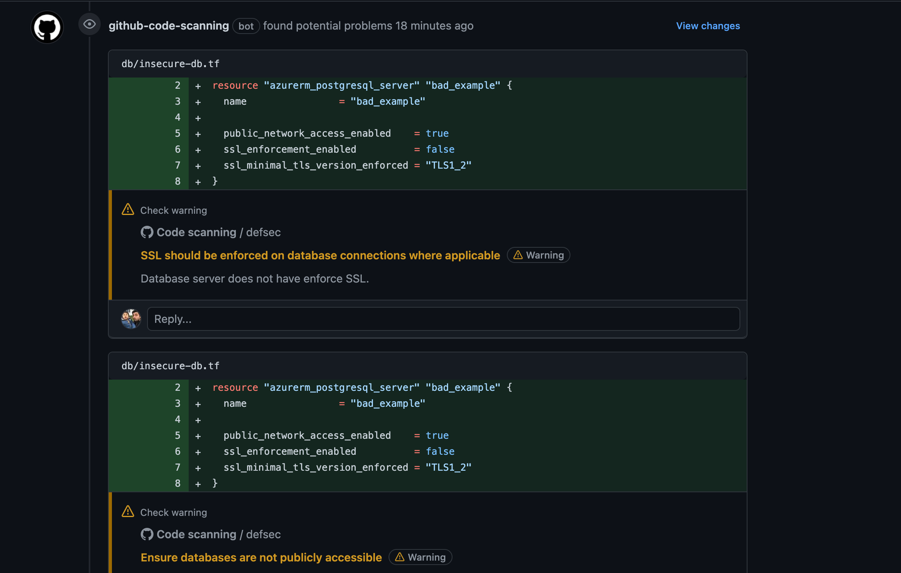
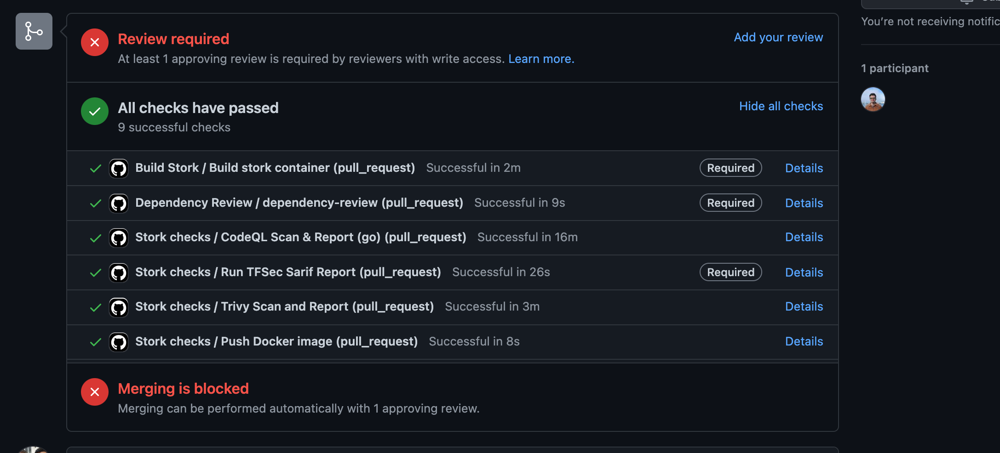

- [ ] $\textcolor{orange}{Keynotes (Friday\ October\ 28,\ 2022\ 9:00am\ -\ 10:30am\ EDT)}$
- [ ] $\textcolor{orange}{Service Mesh (Friday\ October\ 28,\ 2022\ 11:00am\ -\ 11:35am\ EDT)}$
  - [ ] [Title - One API To Rule Them All? What the Gateway API Means For Service Meshes](https://kccncna2022.sched.com/event/182KL/one-api-to-rule-them-all-what-the-gateway-api-means-for-service-meshes-keith-mattix-ii-microsoft-john-howard-google?iframe=no&w=100%&sidebar=yes&bg=no) 
  - [ ] [Presentation](https://static.sched.com/hosted_files/kccncna2022/93/One%20API%20to%20Rule%20Them%20All.pptx)
  - [ ] Gateway API introduced by Kubernetes to build a unified service networking model for Kubernetes
  - [ ] it helps in canary rollout as well
    - [ ] Example 
    ```bash
    apiVersion: gateway.k8s.io/v1beta1
    kind: HTTPRoute
    metadata:
    name: foo
    spec:
    parentRefs:
    - kind: Service
        name: foo
    rules:
        backendRefs:
        - kind: Service
        name: foo
        weight: 90
        - kind: Service
        name: foo-v2
        weight: 10
    ```
  - [ ] upcoming features
    - [ ] Authorization policy (something similar to consul)
    - [ ] egress
    - [ ] workload policy management
  - [ ] $\textcolor{green}{Takeaways}$
    - [ ] this can actually replace Springboot API gateway service for EKS
- [ ] $\textcolor{orange}{CI/CD (Friday\ October\ 28,\ 2022\ 11:55\ -\ 12:30am\ EDT)}$
  - [ ] [Title - From Security Testing To Deployment In a Single PR](https://kccncna2022.sched.com/event/182FS/from-security-testing-to-deployment-in-a-single-pr-sarah-khalife-github-grant-griffiths-portworx?iframe=no&w=100%&sidebar=yes&bg=no)
  - [ ] [Github Repo](https://github.com/stork-kubecon22/stork)
  - [ ] [security workflow](https://github.com/stork-kubecon22/stork/blob/master/.github/workflows/security-scans.yml)
  - [ ] Goals
    - [ ] Run integration + security testing
    - [ ] Detect earlier and block merge
    - [ ] configure branch rules
    - [ ] Automate everything with event triggers
  - [ ] Type of scanning covered in this session
    - [ ] Image scanning
    - [ ] Dependency checks
    - [ ] static code Analysis : Analyzing the code
    - [ ] configurations checks: check k8s yaml for deployments
  - [ ] CICD workflow (Development -> Build job -> Merge PR -> Dev Completed -> QA Team (Run all security scans) ->)
  - [ ] Improved CICD workflow (Dev -> Build -> security checks in parallel -> Merge PR -> Dev Completed)
  - [ ] Tools used
    - [ ] [Trivy](https://github.com/aquasecurity/trivy): Containers scanning
    - [ ] [TFsec](https://github.com/aquasecurity/tfsec): Terraform code to spot potential misconfigurations 
    - [ ] [CodeQL](https://codeql.github.com/) : static code analysis
    - [ ] [Dependable](https://github.com/apsislabs/dependable): tracking dependency relationships
  - [ ] examples
    - [ ] 
    - [ ] 
  - [ ] $\textcolor{green}{Takeaways}$
    - [ ] continuous integration
      - [ ]  kick off builds automatically
      - [ ]  Run integration test
      - [ ]  trigger security scans
      - [ ]  get results before merge
    - [ ] provide transparency
    - [ ] collaboration
    - [ ] quick fixes
- [ ] $\textcolor{orange}{Reliability\ +\ Operational\ Continuity) (Friday\ October\ 28,\ 2022\ 2:00pm\ -\ 03:30pm\ EDT)}$
  - [ ] [Title - Tutorial: kubectl Create Cluster: Production-ready Kubernetes with Cluster API 1.0](https://kccncna2022.sched.com/event/1BZDs/tutorial-kubectl-create-cluster-production-ready-kubernetes-with-cluster-api-10-killian-muldoon-shivani-singhal-yuvaraj-balaji-rao-kakaraparthi-stefan-buringer-vmware-jack-francis-microsoft?iframe=no&w=100%&sidebar=yes&bg=no)
  - [ ] [Presentation](https://static.sched.com/hosted_files/kccncna2022/18/Cluster%20API%20Tutorial%20Kubecon%20NA%202022.pptx.pdf)
  - [ ] [Demo Prerequisites](https://github.com/ykakarap/kubecon-na-22-capi-lab/blob/main/0-prereqs.md#install-docker-kubectl-kind-clusterctl-and-helm-1)
  - [ ] Management cluster is a Kubernetes cluster into which the Cluster API components have been installed
  - [ ] Workload cluster is a Kubernetes cluster that is created and managed by the Cluster API components in the management cluster
  - [ ] Cluster API provides extensible APIs to create Kubernetes clusters across multiple infrastructures
  - [ ] interesting approach to solve the problem of operating and managing clusters
  - [ ] $\textcolor{green}{Takeaways}$
    - [ ] lab is pretty intuitive to get your cluster ready
    - [ ] team can use this to create local cluster instead of docker-compose for end to end testing 