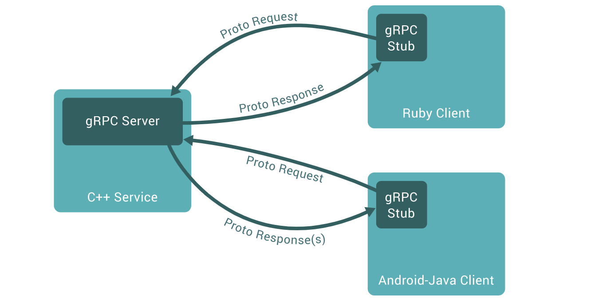

- [ ] $\textcolor{orange}{gRPC}$
  - [ ] What is gRPC? In gRPC, a client application can directly call a method on a server application on a different machine as if it were a local object, making it easier for you to create distributed applications and services. As in many RPC systems, gRPC is based around the idea of defining a service, specifying the methods that can be called remotely with their parameters and return types
  - [ ] Levels up your service mesh with gRPC
  - [ ] GRPC proxyless service mesh provides proxy feature without having to deploy a sidecar.
  - [ ] gRPC [Service mesh features](https://grpc.io/docs/languages/)
  - [ ] Gateway APIs and GAMMA (will soon be supported with GCP traffic director)
  - [ ] [Github](https://github.com/kubernetes-sigs/gateway-api) 
- [ ] $\textcolor{orange}{KubeCampus}$
  - [ ] FREE Kubernetes Courses and Hands-on labs
  - [ ] https://kubecampus.io/