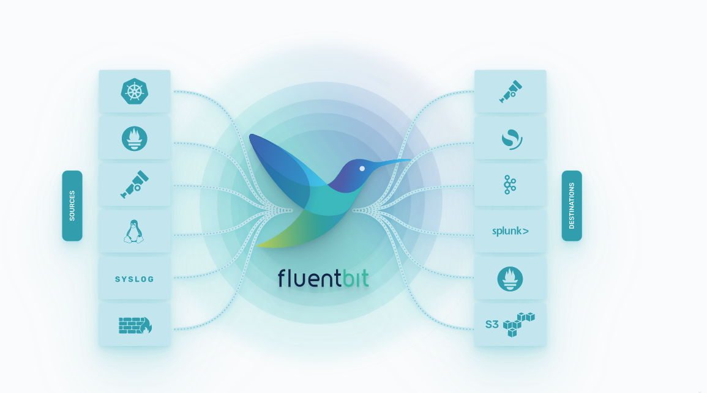

- [ ] $\textcolor{orange}{Keynotes (Wednesday\ October\ 26,\ 2022\ 9:00am\ -\ 10:30am\ EDT)}$
  - [ ] [introducing Carvel for managing and securing the cluster ](https://carvel.dev/)
    - [ ] Carvel has following features
      - [ ] **kapp-controller** provides a declarative way to install, manage, and upgrade applications on a Kubernetes cluster
      - [ ] **ytt** templates are plain YAML documents made from nodes such as maps and arrays
      - [ ] **kapp** is a CLI that does not require server-side components, elevated privileges nor any custom resources. It works well in RBAC-constrained clusters.
      - [ ] and many more...
- [ ] $\textcolor{orange}{Knative (Wednesday\ October\ 26,\ 2022\ 11:00am\ -\ 12:30pm\ EDT)}$
  - [ ] [Title - ContribFest - Knative: Level Up Knative Eventing, And Yourself!)](https://kccncna2022.sched.com/event/182Pu/contribfest-knative-level-up-knative-eventing-and-yourself-limited-availability-first-come-first-served?iframe=no&w=100%&sidebar=yes&bg=no)
  - [ ] [Github Repo](https://github.com/orgs/knative/repositories)
  - [ ] [presentation](https://static.sched.com/hosted_files/kccncna2022/d7/Kubecon%20NA%202022%20--%20Knative%20Contribfest.pdf)
  - [ ] Knative provides a consistent, portable serverless experience across different environments
  - [ ] It is not meant for java at the moment but works for node, go and other languages 
  - [ ] [ ] $\textcolor{green}{Takeaways}$
    - [ ] knative does something similar to what we are doing with serveless
- [ ] $\textcolor{orange}{Istio (Wednesday\ October\ 26,\ 2022\ 02:30pm\ -\ 03:05pm\ EDT)}$
  - [ ] [Title - Istio Today and Tomorrow: Sidecars and Beyond](https://kccncna2022.sched.com/event/1BvZ8/istio-today-and-tomorrow-sidecars-and-beyond-mitch-conners-google-lin-sun-soloio?iframe=no&w=100%&sidebar=yes&bg=no)
  - [ ] [Github Repo](https://github.com/istio/istio)
  - [ ] [presentation](https://static.sched.com/hosted_files/kccncna2022/08/Istio%20Maintainer%20Session.pptx.pdf)
  - [ ] currently Sidecar upgrade requires restarting of applications
  - [ ] Istio is an ambient service mesh - it is sidecar-less 
  - [ ] Ambient Istio mesh has a service called Ztunnel 
  - [ ] Waypoint proxy provides the layer 7 functionality, this runs beside the pods (on node level)
  - [ ] Istio control plane - istiod
  - [ ] HBONE encapsulation when a application A talks to application B, HBONE encapsulation is a mTLS
  - [ ] $\textcolor{green}{Takeaways}$
    - [ ] Istio is pretty nice, widely used and gained its popularity but as we are looking for Consul these all features are provides by Hashicorp
- [ ] $\textcolor{orange}{Reliability\ +\ Operational\ Continuity}$
  - [ ] [Title - Migrating From Single-Node Kubernetes Control Plane To HA In Production](https://static.sched.com/hosted_files/kccncna2022/46/migrating-ha-cp-kubecon2022.pdf)
  - [ ] Chronosphere  - https://chronosphere.io/
  - [ ] But you still have to work on config-map migration and pv volumes by yourself 
- [ ] $\textcolor{orange}{Fluent Bit (Wednesday\ October\ 26,\ 2022\ 4:30pm\ -\ 05:05pm\ EDT)}$
  - [ ] [Title - Fluent Bit V2.0: Unifying Open Standards For Logs, Metrics & Traces](https://fluentbit.io/)
  - [ ] Fluent Bit is a successor of Fluentd (currently we are using Fluentd)
  - [ ] Fluent Bit is a super fast, lightweight, and highly scalable logging and metrics processor and forwarder. It is the preferred choice for cloud and containerized environments.
  - [ ] $\textcolor{green}{Takeaways}$
    - [ ] currently we are using FluentD for logs injection to splunk but to save compute in EKS we should also be using it for prometheus
    - [ ] we should change FluentD to Fluent Bit